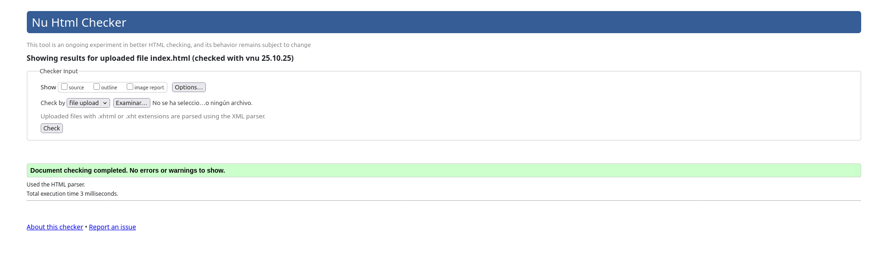

# Documentación Semántica del Sitio KOI Legion Racing

Este documento explica la lógica y las buenas prácticas detrás de la elección de etiquetas HTML en el proyecto web de
KOI Legion Racing. El objetivo principal es usar HTML semántico para dar un significado claro al contenido, mejorar la
accesibilidad y optimizar el SEO.

## Principios Estructurales Globales

En el proyecto web de KOI Legion Racing, todas las páginas del sitio siguen estos principios básicos para garantizar una
estructura clara, funcional y accesible:

### index.html (Página de Inicio)

- **Semántica Correcta**: Utiliza etiquetas como `<section>` para dividir bloques temáticos ("Próxima Carrera", "Últimas
  Noticias", "Nuestros Pilotos") y `<article>` para noticias individuales.
- **Jerarquía Lógica**: El encabezado `<header>` incluye el título y la navegación principal. `<main>` contiene el
  contenido principal de la página.
- **Accesibilidad**: Las imágenes tienen texto alternativo (`alt`), y las fechas usan `<time>` con el atributo
  `datetime`.
- **Metadatos**: `<title>` define el título de la página, y `<meta charset="UTF-8">` asegura la compatibilidad con
  caracteres especiales.
- **Navegación Coherente**: El menú en `<nav>` conecta la página con las demás secciones del sitio.

---

### el-coche.html (El Coche)

- **Semántica Correcta**: `<table>` organiza las especificaciones técnicas del coche, y `<figure>` se usa en la galería
  de imágenes con pies de foto descriptivos (`<figcaption>`).
- **Jerarquía Lógica**: La página está dividida en secciones principales: "Especificaciones Técnicas", "Filosofía de
  Diseño" y "Galería de Desarrollo".
- **Accesibilidad**: Las tablas tienen descripciones claras con `<caption>`, y las imágenes incluyen atributos `alt`.
- **Metadatos**: `<title>` especifica el propósito de la página.
- **Navegación Coherente**: El menú en `<header>` enlaza con las demás páginas.

---

### el-equipo.html (El Equipo)

- **Semántica Correcta**: `<section>` divide la página en "Nuestra Historia", "Personal Clave" y "Nuestros Valores".
  Cada miembro del equipo se describe con un `<article>`.
- **Jerarquía Lógica**: La información está organizada jerárquicamente, comenzando con la historia del equipo hasta sus
  valores fundamentales.
- **Accesibilidad**: Las imágenes del equipo tienen texto alternativo (`alt`) y descripciones detalladas en
  `<figcaption>`.
- **Metadatos**: Contiene `<title>` y `<meta charset="UTF-8">`.
- **Navegación Coherente**: El menú conecta esta página con el resto del sitio.

---

### noticias.html (Noticias)

- **Semántica Correcta**: `<article>` envuelve cada noticia, y se utilizan `
` y `
` para expandir
  contenido adicional, como crónicas de carreras.
- **Jerarquía Lógica**: Las noticias están organizadas por secciones: "Comunicados de Prensa", "Crónicas de Carrera" y "
  Detrás de las Cámaras".
- **Accesibilidad**: Las fechas utilizan `<time>` con el atributo `datetime`, y las listas en crónicas siguen una
  estructura lógica con `<ol>` y `<ul>`.
- **Metadatos**: Incluye `<title>` y `<meta charset="UTF-8">`.
- **Navegación Coherente**: El menú enlaza con las demás páginas del sitio.

---

### patrocinio.html (Patrocinio)

- **Semántica Correcta**: `<form>` estructura el formulario de solicitud de patrocinio, con agrupaciones lógicas usando
  `<fieldset>` y `<legend>`.
- **Jerarquía Lógica**: La página está dividida en "Oportunidades de Patrocinio", "Formulario de Solicitud" y "Kit de
  Prensa".
- **Accesibilidad**: Cada campo del formulario tiene un `<label>` asociado, y se utilizan elementos como `<datalist>`
  para mejorar la experiencia del usuario.
- **Metadatos**: Contiene `<title>` y `<meta charset="UTF-8">`.
- **Navegación Coherente**: El menú conecta esta página con el resto del sitio.

### calendario.html (Calendario)

- **Semántica Correcta**: `<table>` se usa para mostrar los horarios y resultados de las carreras, con etiquetas como
  `<thead>` y `<tbody>` para estructurar los datos.
- **Jerarquía Lógica**: La página está organizada en secciones claras: "Próximo Gran Premio", "Calendario Completo" y "
  Mapa del Mundial".
- **Accesibilidad**: Las tablas incluyen `<caption>` para describir su contenido, y las cabeceras `<th>` aseguran una
  navegación lógica.
- **Metadatos**: Contiene `<title>` y `<meta charset="UTF-8">` en el `<head>`.
- **Navegación Coherente**: Incluye un menú intuitivo para moverse por el sitio.

## Capturas del W3C Validator

En este apartado se deben incluir capturas de pantalla que demuestren la validación de cada uno de los archivos HTML
mencionados en este documento mediante el [W3C Markup Validation Service](https://validator.w3.org/). En la validacion
los html con tabla da un error relacionado con el borde, pero los añadi a proposito para que la tabla fuera legible.

- 
- 
- 
- 
- 
- 

